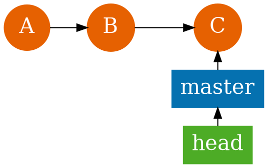
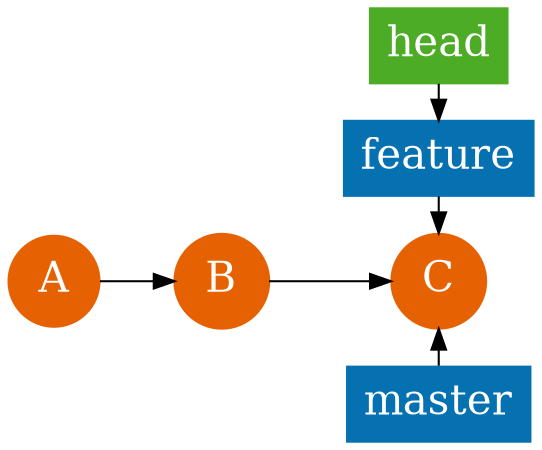
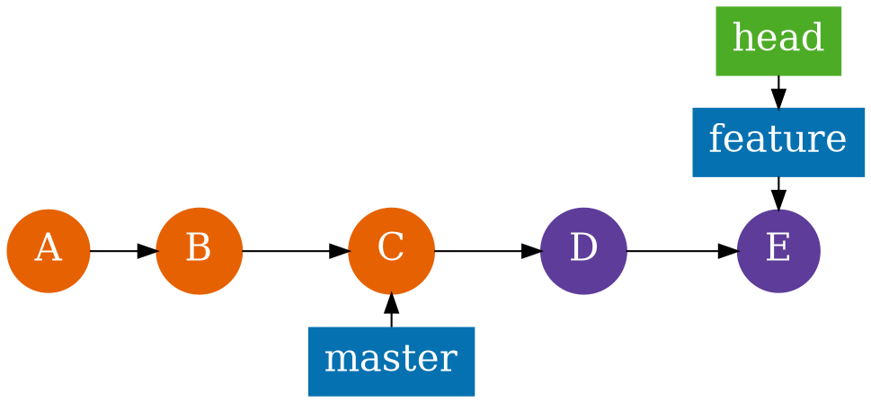
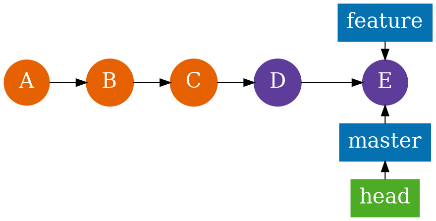
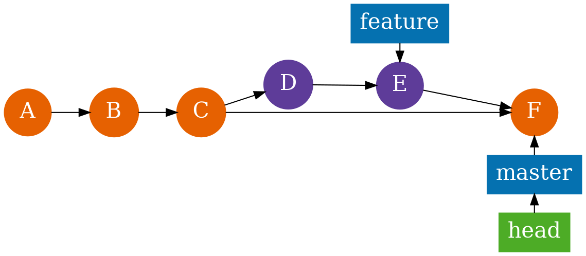

# GIT

# Configuring

<section>
Первоначальная настройка **Git**

```bash
git config --global user.name "Inanov Ivan"
git config --global user.email ivanov@example.com
```
</section>

<section>

.gitconfig
```ini
[alias]
  l = log --pretty=format:\"%C(yellow)%h%C(reset) | %s %C(red)[%aN]%C(green)%d%C(reset)\" --decorate --graph --all
  co = checkout
  ci = commit
  st = status
  br = branch
  mr = merge
```
</section>

<section>
Внешние утилиты

```bash
git config --global diff.tool meld
git config --global difftool.prompt false
git config --global core.editor /usr/bin/vim
```
</section>

<section>
External **diff**

```ini
[diff]
  tool = meld
[difftool]
  path = meld
  prompt = false
```
External **editor**

```ini
[core]
  editor = /usr/bin/vim
```
</section>

# Init

<section>
Инициализировать новый проект c **Git**

```bash
git init new-project
```

Добавить существующий проект в **Git**

```bash
cd existing-project
git init .
```
</section>

# Staging

<section>
```seqdiag
seqdiag {
  activation = none
  dir [label="Working\ndirectory", color="#F1A340", fontsize=14]
  index [label="Index", fontsize=14]
  repo [label="Repository", color="#998DC3", fontsize=14]

  dir <- repo [label="checkout", fontsize=14]
  dir -> index [label="add", fontsize=14]
  dir <- index [label="reset", fontsize=14]
  index -> repo [label="commit", fontsize=14]

}
```
</section>

<section>
## Doing chagnes

```shell
git add .
git reset -- dont-commit.txt
git commit -m 'Here goes message'
```
</section>

# Branches

<section>
Список веток

```bash
$ git branch --all
* master
```


</section>

<section>
Новая ветка
```bash
git branch feature
git checkout feature
git checkout -b feature # сокращённо
```



</section>

<section>
Разработка

```bash
touch D; git add .; git commit -m 'D'
touch F; git add .; git commit -m 'F'
```


</section>

<section>
Слияние **fast-forward, "Перемотка"**

```bash
git checkout master
git merge feature
```


</section>

<section>
Слияние **--no-ff**

```bash
git checkout master
git merge --no-ff feature
```


</section>

---


<section>
```seqdiag
seqdiag {
  activation = none
  dir [label="Working\ndirectory", color="#F1A340", fontsize=14]
  index [label="Index", fontsize=14]
  repo [label="Repository", color="#998DC3", fontsize=14]

  repo -> repo [label="reset --soft", fontsize=14]
  index <- repo [label="reset [--mixed]", fontsize=14]
  dir <- index [label="reset --hard", fontsize=14]
}
```
</section>

<section>
## Undoing changes

**Unstage changes**
```shell
git reset --soft
```

**Save staged changes**
```shell
git reset
```
</section>


<script src="highlight.min.js"></script>